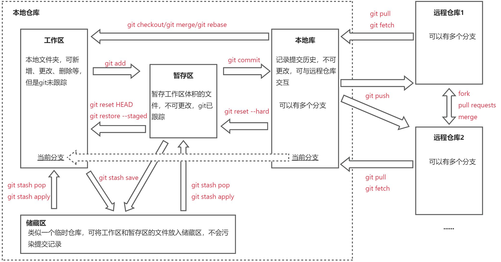
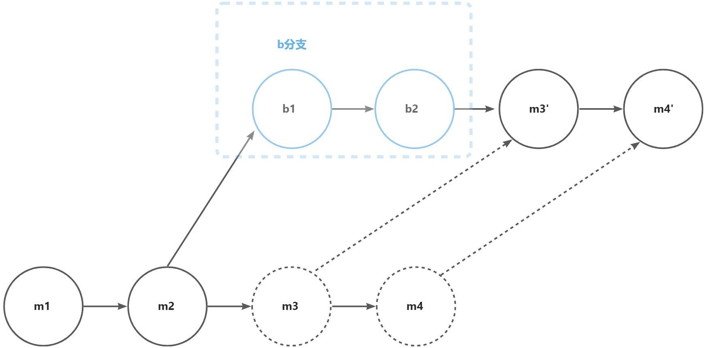

## git常用技巧与项目规范化

### vscode插件推荐

[Git History](https://marketplace.visualstudio.com/items?itemName=donjayamanne.githistory) 本地保存文件更改历史，在本地项目创建一个`.history`文件，记录每个文件更改后 ctrl+s 保存时的文件，可使用 `.gitignore`忽略 .history 的提交
[Git Graph](https://marketplace.visualstudio.com/items?itemName=mhutchie.git-graph) 可视化Git分支和提交历史的工具，提供常用git命令
[GitLens](https://marketplace.visualstudio.com/items?itemName=eamodio.gitlens) git管理工具，提供git常用命令

### git概括图

<!--  -->



#### 其他相关命令

`git stash --include-untracked` / `git stash -u` 将工作区中的所有未跟踪文件和已修改但未暂存的文件一起保存到储藏区。
`git cherry-pick` 就是将指定的提交（commit）应用于其他分支。
......

### git合并commit

#### git merge --squash

[git merge --squash](https://git-scm.com/docs/git-merge/zh_HANS-CN#git-merge---squash) 将一个分支的所有提交压缩成一个单独的提交进行合并，不会产生合并提交，提交历史上只有一个新的提交。

<!--  -->


##### 优点：

- 提交历史更加简洁，便于阅读。
- 保持功能开发的独立性，合并时减少了历史记录的噪音。

##### 缺点：

- 失去了详细的提交历史，无法追踪每个单独的提交。
- 也会产生一次提交，不过不是合并提交，就是普通提交。

#### git rebase -i

[git-rebase](https://git-scm.com/docs/git-rebase/zh_HANS-CN) - 在另一个基础提示之上重新应用提交内容

```bash
//将分支切换到m分支
git checkout m
//把b分支合并到m分支
git rebase b
```



<!--  -->

[git rebase -i](https://git-scm.com/docs/git-rebase/zh_HANS-CN#_%E4%BA%A4%E4%BA%92%E6%A8%A1%E5%BC%8F) **交互式**重定向意味着你有机会编辑被重定向的提交。 你可以重新排列提交的顺序，也可以删除它们（剔除坏的或不需要的补丁）。
git rebase -i HEAD~n(列出即将重新定位的提交。让用户在变基之前编辑该列表，n是要向前合并几个提交

```
选择 pick 操作，git会应用这个补丁，以同样的提交信息（commit message）保存提交
选择 reword 操作，git会应用这个补丁，但需要重新编辑提交信息
选择 edit 操作，git会应用这个补丁，但会因为amending而终止
选择 squash 操作，git会应用这个补丁，但会与之前的提交合并
选择 fixup 操作，git会应用这个补丁，但会丢掉提交日志
选择 exec 操作，git会在shell中运行这个命令

主要使用pick（可以简写为p）和 squash（简写s）
```

##### 优点：

- 保持线性的提交历史，日志记录更整洁。
- 合并后的历史更容易阅读和理解。

##### 缺点：

- 需要解决所有提交的冲突，可能比较繁琐。
- 在公共分支上使用rebase可能导致混乱，建议仅在私有分支上使用。

#### 总结

`git merge` 需要保留完整历史记录的场景
`git merge --squash` 需要简化提交历史的场景，比如：合代码到公共分支上
`git rebase`适合需要简洁线性历史的场景，比如：合代码到个人分支
`git rebase -i`适合需要简洁线性历史，并且修改提交记录，比如：修改提交历史合并commit等
参考
[不会还有人没有用过git rebase合并分支吧？一文详解git merge与git rebase区别](https://juejin.cn/post/7374683456716161063?searchId=20240827173253096FBA893003A1F8D3E3)
[git merge rebase cherry-pick分别什么时候用？一文解惑](https://juejin.cn/post/7034793065340796942)
[Git Merge、Rebase 和 Squash 之间的区别](https://blog.csdn.net/qqrrjj2011/article/details/135636358)

### git关联多个远程仓库

`git remote -v` 查看远程连接

#### 关联多个远程仓库

`git remote add <name> <url>`

```
git remote add origin git@github.com:13982720426/gitTest.git
git remote add gitee https://gitee.com/jackhoo_98/git-test.git
```

#### 取消关联远程仓库

`git remote remove <name>`

```bash
git remote remove origin
```

#### 为origin增加一个push地址(关联一个push url)

**不额外添加远程仓库，而是给现有的远程仓库添加额外的URL**。
使用`git remote set-url --add <name> <url>`，给已有的名为name的远程仓库添加一个远程推送地址

```bash
git remote set-url --add origin https://gitee.com/jackhoo_98/git-test.git
git remote set-url --add origin https://gitlab.niuxiaoer.net/jackhoo/gittest.git
git remote set-url --add origin https://gitlab.niuxiaoer.net/jackhoo/gittest.git
```

#### 删除一个push url

**不是删除远程仓库，而是删除远程推送地址。**
使用`git remote set-url --delete <name> <url>`，给已有的名为name的远程仓库删除一个远程推送地址

```bash
git remote set-url --delete origin https://gitee.com/jackhoo_98/git-test.git
```

`git remote -v` 查看远程连接

```
gitee   https://gitee.com/jackhoo_98/git-test.git (fetch)
gitee   https://gitee.com/jackhoo_98/git-test.git (push)
origin  https://github.com/13982720426/gitTest.git (fetch)
origin  https://github.com/13982720426/gitTest.git (push)
origin  https://gitee.com/jackhoo_98/git-test.git (push)
origin  https://gitlab.niuxiaoer.net/jackhoo/gittest.git (push)
```

`git push` 默认会向三个仓库推送代码
`git push gitee` 会向 别名为 gitee 的仓库推送代码

### github action 同步代码

#### Github Actions

[GitHub Actions](https://link.juejin.cn?target=https%3A%2F%2Fgithub.com%2Ffeatures%2Factions) 是 `GitHub` 的持续集成服务，**可用于自动执行生成、测试和部署**，非常强大
`GitHub` 还允许开发者将自己的脚本，放到代码仓库，供其他开发者引用。如果你需要某个 `action`，不必自己写复杂的脚本，直接引用他人写好的 `action` 即可，整个持续集成过程，就变成了一个 `actions` 的组合。这就是 `GitHub Actions` 最特别的地方
`GitHub` 做了一个[官方市场](https://link.juejin.cn?target=https%3A%2F%2Fgithub.com%2Fmarketplace%3Ftype%3Dactions)，可以搜索到他人提交的 `actions`。另外，还有一个 [awesome actions](https://link.juejin.cn?target=https%3A%2F%2Fgithub.com%2Fsdras%2Fawesome-actions) 的仓库，也可以找到不少 `action`

#### 基本概念

GitHub Actions 有一些自己的术语。

- **workflow** （工作流程）：持续集成一次运行的过程，就是一个 workflow
- **job** （任务）：一个 workflow 由一个或多个 jobs 构成，含义是一次持续集成的运行，可以完成多个任务
- **step**（步骤）：每个 job 由多个 step 构成，一步步完成
- **action** （动作）：每个 step 可以依次执行一个或多个命令（action）

#### 同步代码到 Gitee

参考
[Github Actions 部署 Pages、同步到 Gitee、翻译 README 、 打包 docker 镜像](https://juejin.cn/post/7365757742381957161?searchId=20240828202921701EF29E3FD02700996A)

### 远程仓库添加pr模板

[gitlab给mr添加模板](https://gitlab.niuxiaoer.net/help/user/project/description_templates#description-templates)
在 .gitlab/merge_request_templates/ 下创建一个md文档即可
[github给pr添加模板](https://docs.github.com/en/communities/using-templates-to-encourage-useful-issues-and-pull-requests/creating-a-pull-request-template-for-your-repository)
创建 .github/PULL_REQUEST_TEMPLATE/pull_request_template.md
或者 .github/pull_request_template.md
gitee给pr添加模板
.gitee/pull_request_template.md

## 项目规范化

### 使用Eslint + Prettier + Husky + Commitlint + Lint-staged 约束每一次 Git 提交

当一个项目有多个参与者，强制性的约定会，更好保持统一的风格和规范，有利于项目的维护
git hook
[扩展技能-Git Hooks 了解一下](https://juejin.cn/post/7249281117169614904)

#### 常见工具说明

- [Eslint](https://eslint.org/) ESLint静态分析您的代码以快速查找并修复JavaScript代码中的问题
- [Prettier](https://prettier.io/) 代码格式化工具，更好的代码风格效果
- [husky](https://typicode.github.io/husky/) Git hooks 工具, 可以在执行 git 命令时，执行自定义的脚本程序
- [lint-staged](https://github.com/okonet/lint-staged) 对暂存区 (git add) 文件执行脚本
- [commitlint](https://commitlint.js.org) 检测 git commit 内容是否符合定义的规范
- [styleLint](https://www.stylelint.cn) 检测style样式规范

前提

```
// 1.创建一个初始项目
npx create-react-app
// 2. 删除其他多余文件
```

#### [Eslint](https://eslint.org/docs/v8.x/use/getting-started)

安装

> eslint@9.x 有重大更新，存在兼容问题，导致项目无法启动

```bash
pnpm i eslint@8.x -D
npx eslint --init
```

当前选择配置

```bash
√ How would you like to use ESLint? · problems
√ What type of modules does your project use? · esm
√ Which framework does your project use? · react
√ Does your project use TypeScript? · typescript
√ Where does your code run? · browser
The config that you've selected requires the following dependencies:

eslint, globals, @eslint/js, typescript-eslint, eslint-plugin-react
√ Would you like to install them now? · No / Yes
√ Which package manager do you want to use? · pnpm
```

> 注意 这里module使用的是 esm ，需要给 package.json 添加支持module的属性 `"type": "module",`

安装相关依赖

```bash
pnpm install typescript --save-dev
```

添加忽略文件

> ESLintIgnoreWarning: The ".eslintignore" file is no longer supported. Switch to using the "ignores" property in "eslint.config.mjs": [https://eslint.org/docs/latest/use/configure/migration-guide#ignoring-files](https://eslint.org/docs/latest/use/configure/migration-guide#ignoring-files)
> ESLint新版本不支持添加.eslintignore 文件，需要在配置文件添加ignores

```bash
import globals from "globals";
import pluginJs from "@eslint/js";
import tseslint from "typescript-eslint";
import pluginReact from "eslint-plugin-react";

export default [
  { files: ["**/*.{js,mjs,cjs,ts,jsx,tsx}"] },
  { languageOptions: { globals: globals.browser } },
  pluginJs.configs.recommended,
  ...tseslint.configs.recommended,
  pluginReact.configs.flat.recommended,
  {
    rules: {
      // 自定义规则
      'no-var': 'error', //禁止使用 var
      // "no-console": "warn", // 禁止使用 console
      '@typescript-eslint/no-explicit-any': 'error', // 禁止使用 any
      // '@typescript-eslint/no-explicit-any': 'off',
    },
    settings: {
      react: {
        version: "detect", // 自动检测 React 版本
      },
    },
    // ...
    ignores: [
      "node_modules/",
      "dist/",
      "*.min.js",
      "*.d.ts",
      ".history/",
      "**/.*",
    ],
  },
];

```

> [config配置默认不支持忽略 . 文件，如果需要需要忽略 . 文件 需要添加 "\*_/._"](https://eslint.org/docs/latest/use/configure/migration-guide#ignoring-files)

在package.json 添加脚本 指定校验文件

```json
"scripts": {
  "lint": "eslint --fix src/**/*.{js,jsx,ts,tsx}"
},
```

可以直接运行 `pnpm run lint`

#### [Prettier](https://prettier.io/docs/en/options)

安装

```bash
pnpm i prettier eslint-config-prettier eslint-plugin-prettier -D
```

添加 prettier.config.mjs 配置

```javascript
// Prettier 配置文件
export default {
  // 缩进的宽度（以空格为单位）
  tabWidth: 2,
  // 是否使用 Tab 键进行缩进
  useTabs: false,
  // 使用单引号还是双引号
  singleQuote: true,
  // 行结束符的类型
  endOfLine: 'auto',
  // JSX 中是否使用单引号
  jsxSingleQuote: true,
  // 最大行宽
  printWidth: 80,
  // 是否在语句末尾打印分号
  semi: true,
  // 在对象字面量中是否使用空格
  bracketSpacing: true,
  // JSX 的闭合标签是否在同一行
  jsxBracketSameLine: false,
  // 箭头函数的参数括号的显示方式
  arrowParens: 'always',
  // 是否使用尾随逗号
  trailingComma: 'all',
  // 控制是否每个属性都单独占一行
  singleAttributePerLine: true,
};
```

在 eslint.config.js 中继承 prettier

```javascript
import globals from 'globals';
import pluginJs from '@eslint/js';
import tseslint from 'typescript-eslint';
import pluginReact from 'eslint-plugin-react';
import pluginPrettier from 'eslint-plugin-prettier'; // 引入 Prettier 插件
import eslintConfigPrettier from 'eslint-config-prettier'; // 引入 Prettier 配置

export default [
  { files: ['**/*.{js,mjs,cjs,ts,jsx,tsx}'] },
  { languageOptions: { globals: globals.browser } },
  pluginJs.configs.recommended,
  ...tseslint.configs.recommended,
  pluginReact.configs.flat.recommended,
  // 集成 Prettier
  {
    plugins: {
      prettier: pluginPrettier, // 引入 Prettier 插件
    },
    rules: {
      ...pluginPrettier.configs.recommended.rules,
      ...eslintConfigPrettier.rules,
      // 自定义规则
      'no-var': 'error', //禁止使用 var
      // "no-var": "off", //禁止使用 var
      // "no-console": "warn", // 禁止使用 console
      '@typescript-eslint/no-explicit-any': 'error', // 禁止使用 any
      // '@typescript-eslint/no-explicit-any': 'off',
    },
    settings: {
      react: {
        version: 'detect', // 自动检测 React 版本
      },
    },
    // ...
    ignores: [
      'node_modules/',
      'dist/',
      '*.min.js',
      '*.d.ts',
      '.history/',
      '**/.*',
    ],
  },
];
```

添加忽略文件 .prettierignore

```bash
node_modules/
dist/
*.min.js
*.d.ts
.history/
```

在package.json 添加脚本 指定校验文件

```json
"scripts": {
  "format": "prettier --write src/**/*.{js,jsx,ts,tsx}"
},
// 或者
"scripts": {
  "format": "prettier . --write"
},
```

可以直接运行 `pnpm run format`

#### Husky

Husky 是一款 [Git Hooks](https://git-scm.com/docs/githooks) 工具，可以在执行特定的 git 命令时（如: git commit, git push）触发对应的脚本，您可以使用它来检查提交消息、运行测试、检查代码等。

> Git Hooks 简单来说就是git执行某些操作时而触发定义的动作（钩子）

```bash
npx husky-init
pnpm install
```

安装完成后，你会发现发生以下变化：

1. 项目根目录新增一个名为 `.husky`的文件夹
2. `.husky`文件夹里面有一个名为`pre-commit`脚本文件

```bash
# .husky/pre-commit

#!/usr/bin/env sh
. "$(dirname -- "$0")/_/husky.sh"

npm test
```

pre-commit 见名知义，就是在 commit 执行前的脚本文件。 `pre-commit` 文件中默认配置 `npm test`，此时执行git commit操作会自动执行npm test。

3. `package.json`增加了一个 `prepare`脚本

```json
"scripts": {
  "prepare": "husky install"
},
```

> mac os 需要多执行一个`chmod 777 .husky`命令， "prepare":"husky install && chmod 777 .husky

prepare脚本会在每次`npm install`（不带参数）之后自动执行。 也就是说当我们执行`npm install`安装完项目依赖后会执行`husky install`命令，该命令会创建`.husky/`目录并指定该目录为git hooks所在的目录。

> 如果面临特殊情况，需要绕过 Git Hooks，可以使用 `--no-verify`

```bash
git commit -m "commit_message" --no-verify
```

#### lint-staged

在提交的代码的时候，可以通过 ESLint、Prettier 等工具来格式化代码
但如果直接处理全部代码，首先是可能存在性能问题，其次是可能会修改掉别的同事的代码
这时可以引入 lint-staged，它可以过滤出 Git 代码暂存区文件，这样就不会影响到未更改的文件
安装 lint-staged

```bash
pnpm add -D lint-staged
```

在`package.json`配置lint-staged所需要的规则

```json

"lint-staged": {
  "*.{js,ts,jsx,tsx}": [
    "eslint --fix",
    "prettier --write"
  ],
  "*.{cjs,json}": [
    "prettier --write"
  ],
  "*.{scss,css}": [
    "prettier --write"
  ],
  "*.md": [
    "prettier --write"
  ]
},

```

> eslint --fix 可以根据规范对代码的部分低级问题进行更正，如：缺少/多余分号，缩进格式等。
> 能够修复的规范问题比较有限，需要较大变动才能修复的规范问题，eslint 无法自动修复。如：单行不能超过 80 个字符。
> [https://zh-hans.eslint.org/docs/latest/rules/](https://zh-hans.eslint.org/docs/latest/rules/)

设置pre-commit git hook 来运行lint-staged

```bash
#!/usr/bin/env sh
. "$(dirname -- "$0")/_/husky.sh"

npx lint-staged
```

这样每次执行 `git commit` 都会先执行 `npx lint-staged`

#### Commitlint

Commitlint 可以校验 `git commit message`, 只有规范的 commit message 才能提交，
简单来说，就是当我们运行git commmit -m 'xxx'时，来检查'xxx'是不是满足团队约定好的提交规范的工具。
安装

- @commitlint/cli 是脚手架工具
- @commitlint/config-conventional 是官方推荐可继承的配置文件

```bash
pnpm add -D @commitlint/cli @commitlint/config-conventional
```

项目根目录新建一个 `commitlint.config.mjs` 文件
commitlint.config.mjs 文件配置继承`@commitlint/config-conventional`，当然你也是可以自定义规则

```javascript
// commitlint.config.js
export default {
  // 继承的规则
  extends: ['@commitlint/config-conventional'],
  // 自定义规则
  rules: {
    // @see https://commitlint.js.org/#/reference-rules

    // 提交类型枚举，git提交type必须是以下类型
    'type-enum': [
      2,
      'always',
      [
        'feat', // 新增功能
        'fix', // 修复缺陷
        'docs', // 文档变更
        'style', // 代码格式（不影响功能，例如空格、分号等格式修正）
        'refactor', // 代码重构（不包括 bug 修复、功能新增）
        'perf', // 性能优化
        'test', // 添加疏漏测试或已有测试改动
        'build', // 构建流程、外部依赖变更（如升级 npm 包、修改 webpack 配置等）
        'ci', // 修改 CI 配置、脚本
        'revert', // 回滚 commit
        'chore', // 对构建过程或辅助工具和库的更改（不影响源文件、测试用例）
      ],
    ],
    'subject-case': [0], // subject大小写不做校验
  },
};
```

> 如果eslint配置的是 JavaScript modules (import/export)，请使用 export default 导出 commitlint.config.mjs。
> 同时给 package.json 添加支持module的属性 `"type": "module",`

**@commitlint/config-conventional** 这是一个规范配置,标识采用什么规范来执行消息校验, 这个默认是**_Angular_**的提交规范

| **类型** | **描述**                                               |
| -------- | ------------------------------------------------------ |
| build    | 编译相关的修改，例如发布版本、对项目构建或者依赖的改动 |
| chore    | 其他修改, 比如改变构建流程、或者增加依赖库、工具等     |
| ci       | 持续集成修改                                           |
| docs     | 文档修改                                               |
| feat     | 新特性、新功能                                         |
| fix      | 修改bug                                                |
| perf     | 优化相关，比如提升性能、体验                           |
| refactor | 代码重构                                               |
| revert   | 回滚到上一个版本                                       |
| style    | 代码格式修改, 注意不是 css 修改                        |
| test     | 测试用例修改                                           |

新增 Husky hook
`.husky/`添加 `commit-msg` 脚本，这样在每次 `git commit` 的时候执行 commitlint 校验

```bash
#!/bin/sh
. "$(dirname "$0")/_/husky.sh"

npx --no-install commitlint --edit $1
```

#### [StyleLint](https://www.stylelint.cn/user-guide/get-started)

安装

```bash
# 以scss为例 确保支持scss
pnpm install --save-dev sass postcss postcss-scss
```

```bash
# 安装stylelint相关配置
pnpm install --save-dev stylelint-scss stylelint stylelint-config-standard stylelint-config-recommended
```

stylelint.config.mjs 配置

```json
// 导出 stylelint 配置对象
export default {
  extends: ['stylelint-config-standard', 'stylelint-config-recommended'],
  plugins: ['stylelint-scss'],
  // 指定使用的语法解析器
  // postcss-scss 用于解析 SCSS 语法
  customSyntax: 'postcss-scss',
  // 规则配置
  rules: {
    // 添加规则
    // 在块开始的大括号前添加空格
    'block-opening-brace-space-before': 'always',
    // 在声明块末尾添加分号
    'declaration-block-trailing-semicolon': 'always',
    // 字符串引用使用单引号
    // "string-quotes": "single",
    'string-quotes': 'double',
    // 选择器列表后的逗号后添加空格
    'selector-list-comma-space-after': 'always',
    // 缩进使用两个空格
    indentation: 4,
    // 在注释前添加空行
    'comment-empty-line-before': 'always',
    // 限制 ID 选择器的最大数量
    'selector-max-id': 2,
    // 色彩值中的十六进制数使用小写字母
    'color-hex-case': 'lower',
    // 选择器列表后的逗号后添加空格
    'selector-list-comma-space-after': null,
  },
};

```

在 package.json 添加脚本

```json
"scripts": {
    "format": "prettier --write src/**/*.{js,jsx,ts,tsx}",
    "style": "pnpm run format && stylelint **/*.css **/*.scss --fix"
  },
```

> 由于直接使用 `npx stylelint **/*.css **/*.scss --fix` 部分规则存在报错，不兼容的情况，但是 `prettier`又能根据那些规则进行修复，所以不推荐`stylelint --fix`

在 package.json 的 `lint-staged` 配置 `"*.{scss,css}"`时，只需要配置 `"prettier --write"`即可在提交时自动修复部分问题

```json
"lint-staged": {
  "*.{scss,css}": [
    "prettier --write"
  ],
},
```

参考
[使用 Husky + Commitlint + Lint-staged 约束每一次 Git 提交](https://zhuanlan.zhihu.com/p/653197000)
[Eslint + Prettier + Husky + Commitlint+ Lint-staged 规范前端工程代码规范](https://juejin.cn/post/7038143752036155428?from=search-suggest#heading-5)
[Eslint + Prettier + stylelint + Husky + Lint-staged 规范你的工程git提交信息和代码规范](https://juejin.cn/post/7018053886699110407?from=search-suggest)
